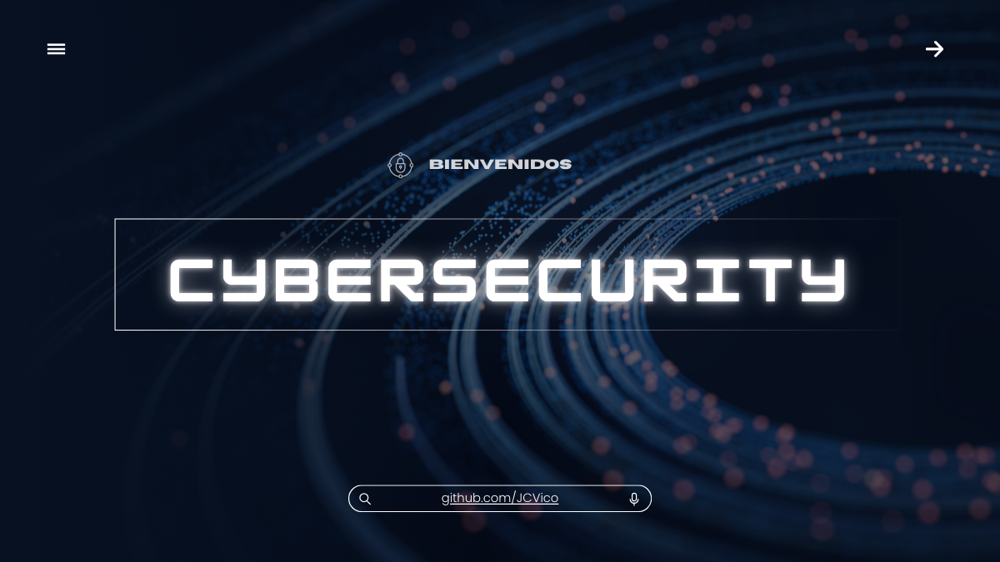

# 👋 ¡Hola! Soy Juan Carlos Vico

### 🛡️ Analista de Ciberseguridad Junior | Blue Team & DFIR

Bienvenid@ a mi portfolio personal. Aquí documento mi transición profesional y mis proyectos prácticos en el mundo de la **Defensa Digital (Blue Team)**, la **Respuesta ante Incidentes** y el **Análisis Forense**.

---

### 🧠 ¿Quién soy?

Soy un perfil técnico en constante evolución. Vengo del **mantenimiento industrial**, un sector exigente donde aprendí la importancia de la disciplina, la resolución de problemas bajo presión y los protocolos de seguridad.

Hoy aplico esa mentalidad práctica a la ciberseguridad. Tras una formación intensiva, me he especializado en la **monitorización, detección y análisis de amenazas**, buscando aportar valor real en entornos SOC.

---

### 🛠️ Tech Stack & Herramientas

Mi enfoque es práctico. Estas son las tecnologías y herramientas con las que trabajo:

* **Monitorización & SIEM:** Splunk (Búsquedas SPL), Wazuh.
* **Detección & Amenazas:** Reglas Sigma, MITRE ATT&CK, Atomic Red Team.
* **DFIR (Forense y Respuesta):** FTK Imager, Volatility, Autopsy, KAPE.
* **Análisis de Red:** Wireshark, Snort, TCPdump.
* **Scripting:** Bash, PowerShell.

---

### 📂 ¿Qué encontrarás en este repositorio?

Este espacio es mi laboratorio personal. Aquí subo evidencias de mi aprendizaje continuo:

* ✅ **Blue Team Labs:** Ejercicios de detección de amenazas y uso de SIEMs.
* ✅ **Ingeniería de Detección:** Creación de reglas personalizadas (Sigma/YARA) para detectar ataques específicos.
* ✅ **Análisis Forense:** Prácticas de adquisición y análisis de evidencias (Memoria RAM, Discos y Artefactos de Windows).
* ✅ **Scripting:** Automatización básica para tareas de seguridad.
* ✅ **Informes:** Documentación paso a paso de retos CTF y simulaciones de incidentes.

---

### 🔗 Repositorios y Proyectos Destacados

* **📁 [Blue Team Ops]:** (Añade aquí el link) *Laboratorios de detección con Splunk, validación de defensas con Atomic Red Team y reglas Sigma.*
* **📁 [DFIR - Proyecto Final]:** Investigación completa, cadena de custodia y análisis forense de un caso práctico.
* **📁 [Network Analysis]:** Detección de intrusos con Snort y análisis de tráfico malicioso.

---

### 📚 Formación y Certificaciones

Me mantengo actualizado constantemente. Mi base formativa incluye:

* 🎓 **Experto en Blue Team** (250h) | INCIBE - Fundación ONCE (2025)
* 🎓 **Analista Forense Digital & IR** (300h) | INCIBE - Fundación ONCE (2025)
* 🛡️ **Google Cybersecurity Certificate** | Coursera
* 💻 **CCST: Cybersecurity** | Cisco Certified Support Technician

**🚀 Próximo Objetivo (Roadmap):**
* 🔜 **CHFI (Computer Hacking Forensic Investigator)** | EC-Council *(Preparación en curso)*

---

### 🌐 Contacto

Si buscas un perfil junior con ganas, disciplina y base técnica, hablemos.

* 📫 **Email:** juancarlosvicolopez@gmail.com
* 🔗 **LinkedIn:** [Juan Carlos Vico López](https://www.linkedin.com/in/juan-carlos-vico-lopez/)

> *"La seguridad no es un producto, es un proceso."*

---
